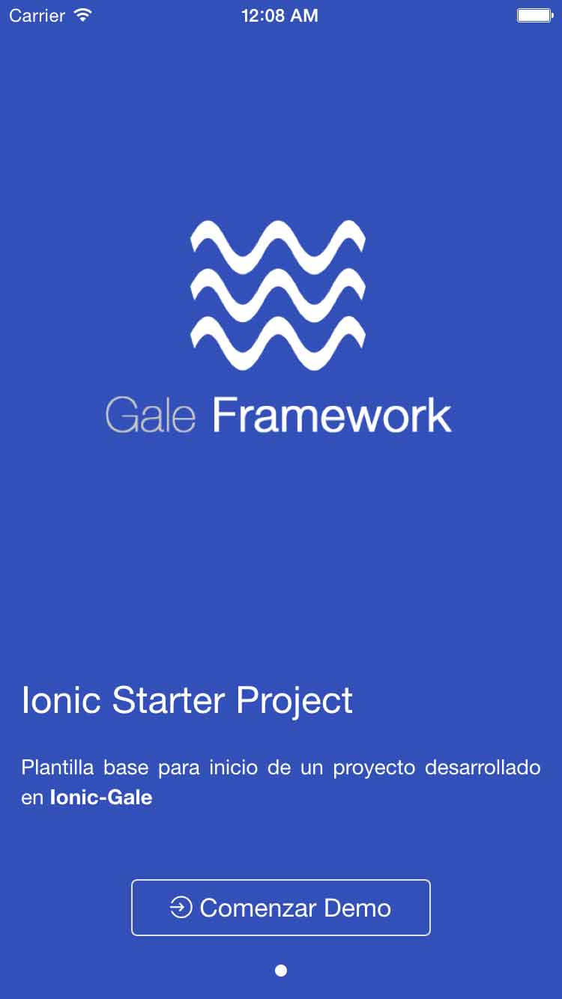

# Ionic Starter Project - Mobile Application

- Mobile Application (Ionic + Gale + Cordova)

## Resources 

- [Source](https://github.com/dmunozgaete/angular-gale-starter-ionic)
- [Angular Gale Doc's](http://angular-gale.azurewebsites.net/)
- [Framework API](http://gale.azurewebsites.net/)

## Get Started

### Minimun Ionic Dependencies

```sh
# bash
ionic info				# ionic module's information

Cordova CLI: 5.4.1
Gulp version:  CLI version 3.9.0
Gulp local:   Local version 3.9.1
Ionic Framework Version: 1.3.0
Ionic CLI Version: 2.0.0
Ionic App Lib Version: 2.0.0-beta.20
ios-deploy version: 1.8.6 
ios-sim version: 5.0.8 
Node Version: v4.1.2
```

### Get dependencies

```sh
# bash
npm install					# restore npm packages
ionic state reset --plugins	# restore ionic plugin's
bower install				# restore bower libraries
```

### Mount development server

```sh
# bash
ionic serve -d			# Mount web server without [livereload]
```

### Build for target device's

```sh
# bash
ionic build	ios			# build for ios (only for mac)
ionic build	android		# build for android
```

## Screenshot

